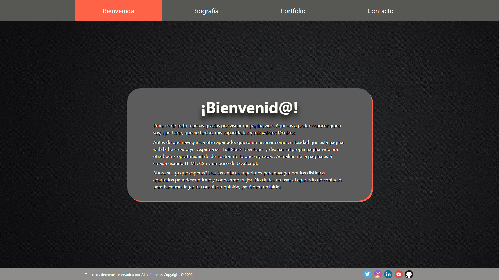
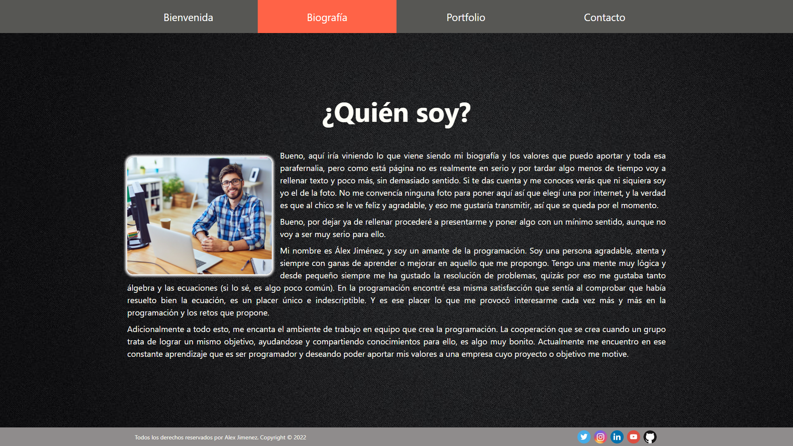

# Proyecto página web personal
Este proyecto es una página web que emula como sería mi página web personal. La estructura de la web mantiene los elementos principales en el centro manteniendo márgenes
comunes en las distintas secciones (esta decisión es debida a que los usuarios suelen concentrar su atención en el centro de la pantalla). Para la distribución de 
los distintos elementos se usa flexbox y se modifican los elementos en función del ancho del navegador para así mantener un diseño responsive que se adapte a los distintos 
dispositivos. Adicionalmente, la página web ha sido creada manteniendo un tema oscuro. Esta decisión no es solo por preferencia personal, sino además porque la mayoría de valores por defecto
de los elementos HTML tienen un tema claro y cambiandolos a temas oscuros prácticaba más la utilización de CSS.

El proyecto fue creado como trabajo final de la fase de Ramp Up del curso intensivo de Full Stack Developer de The Bridge Valencia. 
El próposito del proyecto era afianzar los conocimientos obtenidos durante esta fase e implementarlos es una página web básica.

## Tecnologías que he utilizado 🛠️

>La página web ha sido creada usando HTML, CSS y JavaScript.

#### Vista previa 
Vista Bienvenida:

 

Vista Biografía:

 

Vista Portfolio:

 

Vista Contacto:

 

Hecho por [Alex Jimenez](https://github.com/radikalex) 🤗
